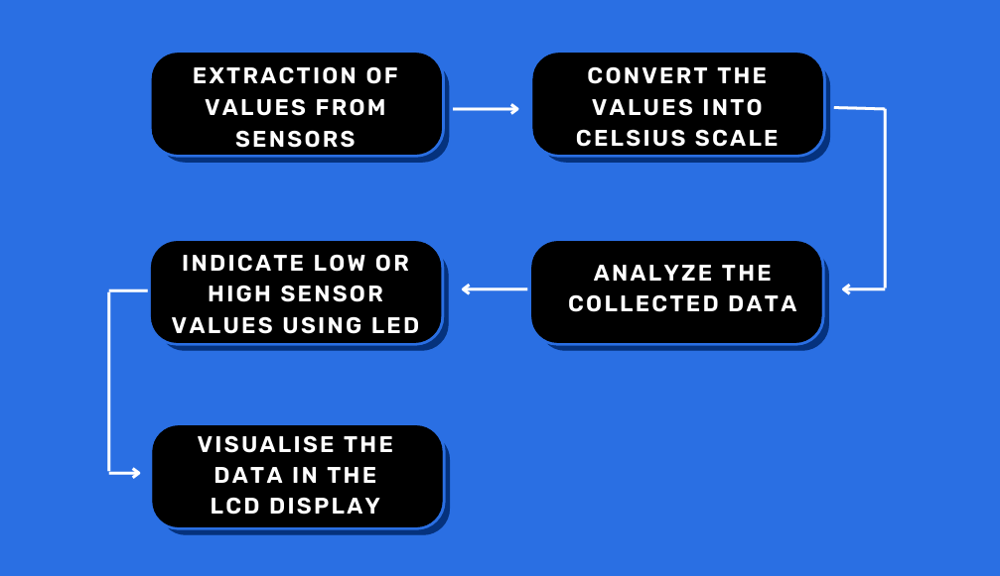
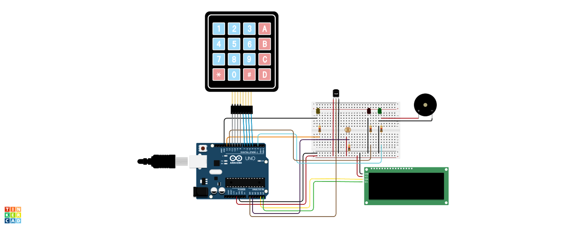

# Weather Monitoring System

An Arduino-based weather monitoring system that reads ambient temperature and light intensity, displays live readings on a 16x2 I2C LCD, and lets the user set a target temperature threshold via a 4x4 keypad. Status LEDs indicate whether the current temperature is above or below the target, and a separate LED reacts to ambient light levels.

## Features

- **Temperature sensing** - reads an analog temperature sensor and converts the raw ADC value to degrees Celsius.
- **Light intensity sensing** - reads an LDR (light-dependent resistor) to monitor ambient light.
- **Keypad input** - enter a target temperature using a 4x4 matrix keypad; press `A` to clear and re-enter a new value.
- **LCD display** - shows live temperature and light intensity readings on a 16x2 I2C LCD.
- **Status indicators**:
  - Light LED turns on/off based on an ambient light threshold.
  - Red LED lights up when the current temperature is below the target.
  - Green LED lights up when the current temperature meets or exceeds the target.

## Hardware Required

| Component | Purpose |
|---|---|
| Arduino (Uno/compatible) | Main controller |
| 16x2 I2C LCD | Display readings |
| 4x4 matrix keypad | Enter target temperature |
| Analog temperature sensor | Temperature input |
| LDR (photoresistor) | Light intensity input |
| 3x LEDs (light indicator, red, green) | Status output |
| Resistors, breadboard, jumper wires | Supporting circuitry |

### Pin Connections

| Signal | Arduino Pin |
|---|---|
| Temperature sensor | A0 |
| LDR | A1 |
| Light indicator LED | D13 |
| Red LED | D12 |
| Green LED | D2 |
| Keypad rows | D11, D10, D9, D8 |
| Keypad columns | D7, D6, D5, D4 |
| LCD | I2C (SDA/SCL) |

## System Overview

The block diagram above shows the overall system flow: sensor inputs (temperature, light) and user input (keypad) feed into the Arduino, which processes the data and drives the LCD display and LED outputs.

## Circuit Diagram

